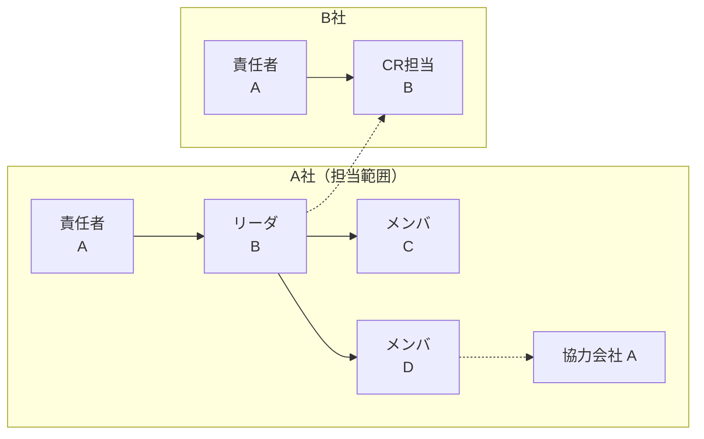

# A社・B社のプロジェクト体制

A社のリーダBがB社のCR担当Bと連携します。協力会社Aとの窓口はA社のメンバDです。

## 会社別の担当体制

実線は社内の体制、破線は連携を示します。

```mermaid
flowchart LR
  accTitle: A社・B社のプロジェクト体制図
  accDescr: A社は責任者Aの下にリーダB、リーダBの下にメンバCとメンバDがいる。メンバDが協力会社Aとの連携窓口。B社は責任者Aの下にCR担当Bがいる。A社のリーダBとB社のCR担当Bが連携する。
  subgraph company_a["A社（担当範囲）"]
    direction TB
    a_owner["責任者<br/>A"]
    a_lead["リーダ<br/>B"]
    a_member_c["メンバ<br/>C"]
    a_member_d["メンバ<br/>D"]
    partner["協力会社 A"]
    a_owner --> a_lead
    a_lead --> a_member_c
    a_lead --> a_member_d
    a_member_d -.-> partner
  end
  subgraph company_b["B社"]
    direction TB
    b_owner["責任者<br/>A"]
    b_cr["CR担当<br/>B"]
    b_owner --> b_cr
  end
  a_lead -.-> b_cr
```
