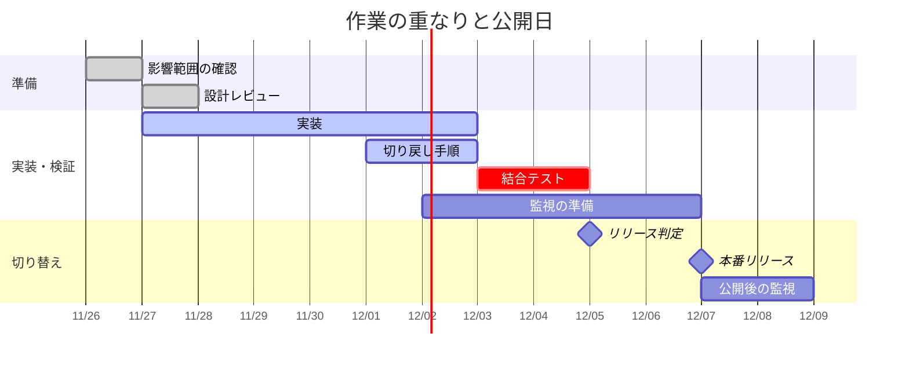

# リリース準備のスケジュール

約2週間のアプリ更新計画です。実装を進めながら、切り戻し手順と本番監視を準備します。

## 作業期間とリリース判断

```mermaid
gantt
    title 作業の重なりと公開日
    dateFormat YYYY-MM-DD
    axisFormat %m/%d

    section 準備
    影響範囲の確認 :done, scope, 2026-11-26, 1d
    設計レビュー :done, review, after scope, 1d

    section 実装・検証
    実装 :active, build, 2026-11-27, 6d
    切り戻し手順 :active, backout, 2026-12-01, 2d
    %% delayed: backout
    結合テスト :crit, test, after build review, 2d
    監視の準備 :monitor, 2026-12-02, until release

    section 切り替え
    リリース判定 :milestone, gate, after test backout, 0d
    本番リリース :milestone, release, 2026-12-07, 0d
    公開後の監視 :after release, 2d
```

- **結合テスト**は実装と設計レビューの両方が終わってから始めます。
- **リリースの可否**は結合テストと切り戻し手順の確認結果をそろえて判定します。
